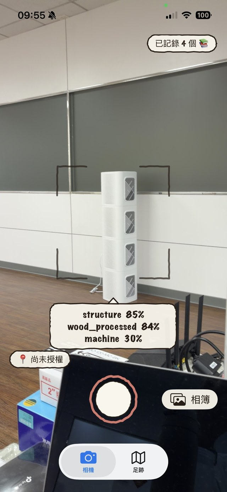
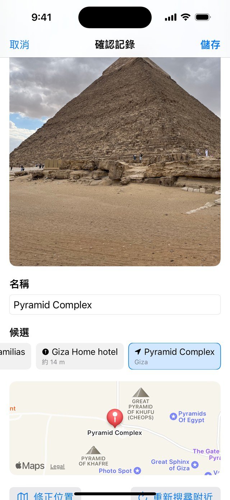
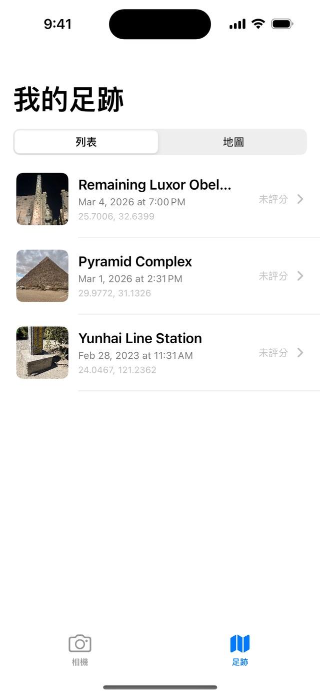
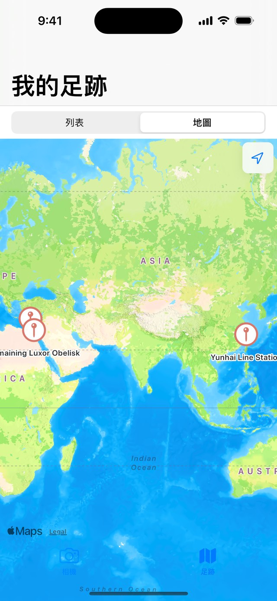
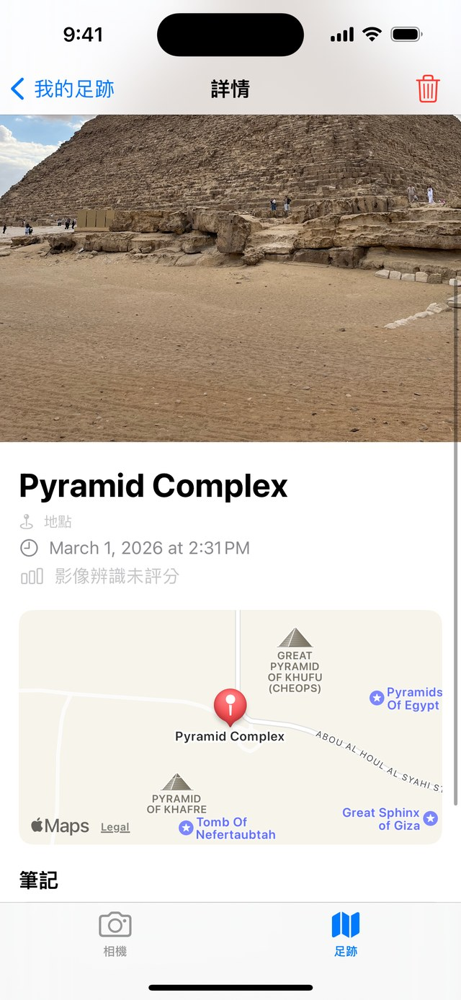

# RecognizeLandmark

用 iPhone 後鏡頭即時辨識畫面內容,可以拍照保存成記錄,並在地圖上回顧的 iOS App。

辨識採「**多來源候選**」策略:按下快門時平行跑三件事——(1) Apple Vision 影像分類(回答「是什麼類型」)、(2) `MKLocalSearch` 附近 POI 搜尋、(3) `CLGeocoder` 反向地理編碼(後兩者一起回答「是哪個具體地點」)——把候選帶入確認頁讓使用者點選或編輯後才存。日常使用 GPS 拿到的具名 POI(例:龍山寺、85 大樓)通常比純影像辨識可靠;影像 ML 目前用 `VNClassifyImageRequest`(輸出 building / tower / church 這類通用標籤),未來可替換為地標專用的 Core ML 模型,只需要動 `CaptureClassifier.swift`。

---

## 畫面

| 相機即時辨識 | 拍照 / 匯入確認頁 | 足跡列表 |
|---|---|---|
|  |  |  |
| 取景時每 0.5 秒跑一次 Vision 分類,只顯示信心 ≥ 20% 的前 3 名 | POI / 地址 / 影像三路候選合併排序,可點 chip、改名、修正位置,確認才存 | 時間倒序,顯示縮圖、地點、時間與座標;沒有影像結果時標「未評分」 |

| 足跡地圖 | 記錄詳情 |
|---|---|
|  |  |
| 所有含座標的記錄,100 公尺內會聚合成一個 pin | 大圖、地點、拍攝時間、影像信心、地圖標記與可編輯筆記 |

第二張就是確認頁存在的理由:距離最近的 POI 常常是隔壁的旅館或民宿而不是地標本身(這張的候選裡就混著 `Giza Home hotel`),所以名稱不自動採用,要人挑過或改過才存。

> 相機那張為實機截圖,其餘為 iOS 模擬器。示範資料是作者自己拍的照片(埃及吉薩、路克索、台灣雲海保線所),照片內嵌的 GPS 直接用來查附近 POI 與反向地理編碼。截圖壓縮流程見 `tools/prep_screenshots.py`。

---

## 功能

- **相機 tab**:即時取景 + 每 0.5 秒辨識一次,顯示信心 ≥ 20% 的前 3 名(僅作為拍照前的視覺回饋)。
- **相簿匯入**:可從系統 Photos picker 選一張舊照片,優先沿用內嵌拍攝時間與 GPS,再走與相機相同的多來源候選／確認／儲存流程;沒有 GPS 時可在確認頁手動選位置。
- **拍照確認頁**:按下快門後同時跑「附近 POI / 反向地理編碼 / 影像 ML」三路候選,跳出確認頁讓使用者點選候選 chip 或自己編輯名稱、加筆記,確認才正式存。取消則丟棄(不留孤兒照片檔)。
- **足跡 tab**:可切換時間倒序列表與地圖。列表顯示縮圖、地點、畫面內容、時間與座標;地圖會聚合 100 公尺內的記錄,點 pin 可看縮圖摘要並進入詳情。只有影像辨識有結果時才顯示「影像信心」,否則顯示「未評分」。
- **詳情頁**:大圖、地圖標記(MapKit)、可編輯的筆記、右上角刪除確認。

---

## 技術堆疊

| 層 | Framework |
|---|---|
| UI(相機主流程) | UIKit + Storyboard |
| UI(列表 / 詳情 / 確認頁) | SwiftUI |
| 相機 | AVFoundation |
| 影像 ML | Vision |
| 地圖 / POI 搜尋 | MapKit |
| 位置 / 反向地理編碼 | CoreLocation |
| 持久化 | SwiftData(metadata)+ 自管檔案(照片本體) |

架構決策與替代方案見 [DECISIONS.md](./DECISIONS.md)。

核心辨識流程以 closure injection 隔離 `CaptureClassifier` 與 `PlaceLookup`,單元測試不需真實相機、GPS 或網路。`PhotoStorage` 也可指定暫存目錄,避免檔案測試污染 App Documents。

---

## 環境需求

- macOS + Xcode 15 以上
- iOS 17.2 以上(實機測試;模擬器無相機)
- Swift 5.0
- 一台可用後鏡頭的 iPhone

---

## 建置與執行

1. 用 Xcode 開啟:

   ```bash
   open RecognizeLandmark.xcodeproj
   ```

2. 在 Xcode 上方選擇你的 iPhone 作為執行目標(模擬器無法用相機)。
3. 第一次 build 之前,設定你自己的 signing:

   ```bash
   cp Config/Signing.local.xcconfig.example Config/Signing.local.xcconfig
   ```

   然後編輯 `Config/Signing.local.xcconfig`:

   ```xcconfig
   DEVELOPMENT_TEAM = YOUR_TEAM_ID
   PRODUCT_BUNDLE_IDENTIFIER = com.yourname.RecognizeLandmark
   ```

   `Signing.local.xcconfig` 已被 git 忽略,不會把個人 Team ID 或 bundle id commit 進公開 repo。也可以直接在 Xcode 的 `Signing & Capabilities` 選自己的 Team;若 Xcode 改到專案檔,請確認不要把個人簽章資訊提交出去。
4. 按 `⌘R` 執行。
5. App 啟動後會依序請求相機與位置權限,允許後即可開始使用。

### Signing 疑難排解

- `Signing for "RecognizeLandmark" requires a development team`:尚未設定 `DEVELOPMENT_TEAM`;請建立 `Config/Signing.local.xcconfig` 或在 Xcode 選 Team。
- `Bundle identifier ... is not available`:請把 `PRODUCT_BUNDLE_IDENTIFIER` 改成你帳號底下唯一的值。
- 公開版預設使用 `com.example.RecognizeLandmark`,只適合作為 clone 後的安全預設值;實機執行通常需要改成自己的 bundle id。

---

## 操作

### 相機 tab
- 啟動後畫面會顯示即時辨識結果(信心 ≥ 20% 的前 3 名),沒到門檻時顯示「(無辨識結果)」。這只是 HUD 視覺回饋,**不會直接被存進記錄**。
- 按快門 → 暫停取景 → 同步跑影像 ML、`MKLocalSearch` 附近 POI(半徑 100 m)、`CLGeocoder` 反向地理編碼 → 跳出確認頁。
- 確認頁可以:點候選 chip(POI / geocode / image 三種來源用不同 icon 標示)、改名稱、加筆記、看地圖預覽。沒有任何候選時(例如拒絕位置權限且影像 ML 都低於門檻),預填欄位會放當下時間戳記。
- **只有按「儲存」才寫入 SwiftData + 寫照片檔**;按「取消」就完全丟棄,不會留下孤兒檔。
- 點右下角「相簿」可選取既有照片。系統 picker 不要求 App 取得完整照片圖庫權限;若照片含 EXIF GPS,會用原拍攝位置搜尋 POI,否則可用「修正位置」手動指定。

### 足跡 tab
- 時間倒序列表,點任一筆進入詳情。
- 列表左滑可直接刪除;詳情頁右上角垃圾桶會跳確認對話框。
- 詳情頁可編輯筆記,變更會即時寫回 SwiftData。
- 切換到地圖可查看所有含座標的記錄;100 公尺內的記錄會聚合並顯示筆數。點 pin 後可從底部摘要卡進入最近一筆詳情。

---

## 專案結構

```
RecognizeLandmark/
├── RecognizeLandmark.xcodeproj/      # Xcode 專案
├── docs/
│   └── screenshots/                  # README 用的截圖(已壓成 640px 寬 JPEG)
├── tools/
│   ├── make_icon.py                  # 用 Pillow 重新產生 1024x1024 app icon
│   └── prep_screenshots.py           # 把原始截圖縮到 README 尺寸
└── RecognizeLandmark/
    ├── App/
    │   ├── AppDelegate.swift
    │   └── SceneDelegate.swift       # 程式建立 TabBarController(相機 / 記錄)
    ├── Camera/
    │   └── ViewController.swift      # 相機 + 即時 HUD 辨識 + 拍照流程
    ├── CaptureReview/                # 拍照後的確認頁流程
    │   ├── CaptureCandidate.swift    # 候選資料模型(POI / geocode / image / fallback)
    │   ├── CaptureClassifier.swift   # 一次性影像 ML(換 Core ML 地標模型只動這支)
    │   ├── PlaceLookup.swift         # MKLocalSearch + CLGeocoder
    │   └── CaptureReviewView.swift   # SwiftUI 確認頁(大圖 / chip / 地圖 / 筆記)
    ├── Records/                      # 記錄列表 + 詳情
    │   ├── RecordsListView.swift     # SwiftUI 記錄列表(@Query)
    │   └── RecordDetailView.swift    # SwiftUI 詳情頁(大圖 / Map / 筆記 / 刪除)
    ├── Storage/                      # 資料層
    │   ├── LandmarkRecord.swift      # SwiftData @Model:時間/名稱/信心/座標/筆記
    │   ├── Persistence.swift         # SwiftData ModelContainer 共用
    │   └── PhotoStorage.swift        # Documents/photos/ 下的 JPEG 自管儲存
    ├── Services/                     # 系統 wrapper
    │   └── LocationProvider.swift    # CoreLocation 取當下座標
    └── Resources/
        ├── Base.lproj/
        │   ├── Main.storyboard       # 相機畫面 UI(含 recognizedLabel)
        │   └── LaunchScreen.storyboard
        ├── Assets.xcassets/          # 含 AppIcon.appiconset(1024x1024 PNG)
        └── Info.plist                # NSCameraUsageDescription / NSLocationWhenInUseUsageDescription
```

---

## 資料儲存

- **記錄(metadata)**:SwiftData(`LandmarkRecord`),分開保存使用者確認的地點名稱與影像辨識的內容／信心,另含時間、照片檔名、經緯度與筆記。POI／地址本身沒有影像信心,不會再以 0% 冒充評分。
- **照片(影像本體)**:不存進 SwiftData,放在 App Documents 下的 `photos/` 目錄,以 UUID 為檔名的 JPEG(壓縮品質 0.85),由 `PhotoStorage` 統一管理。
- **刪除**:刪除一筆記錄時會同步清掉對應照片檔,避免孤兒檔案。

---

## 權限

- `NSCameraUsageDescription`:即時辨識與拍照所需。拒絕時會顯示前往設定入口,且仍可使用相簿匯入。
- `NSLocationWhenInUseUsageDescription`:拍照當下記錄座標,讓詳情頁可以用地圖回顧位置;拒絕也能正常使用,只是不會有地圖。

---

## 隱私

這個 App 完全在本機運作:沒有自己的後端、沒有 analytics 或 tracking SDK、不會把你的照片或位置上傳到任何遠端伺服器。

- **相機**:畫面僅用於即時辨識 HUD 與拍照,不錄影、不外送。
- **位置**:只在按下快門時取一次當下座標,記在那筆記錄上;拒絕位置權限也能正常使用。
- **照片**:存在 App 本機沙盒(`Documents/photos/`),刪除記錄時連同照片檔一起刪除。
- **記錄 metadata**:存在本機 SwiftData,不外送。
- **Apple 系統服務**:拍照時會用 `MKLocalSearch`(附近 POI 搜尋)與 `CLGeocoder`(反向地理編碼),這兩個是 Apple 提供的系統服務,座標會送到 Apple 處理,依 Apple 隱私政策處理。

---

## 替換成地標模型

要從通用分類換成具名地標辨識:

1. 取得一個地標分類用的 `.mlmodel`(例如以 Google Landmarks 訓練、轉成 Core ML 的版本)。
2. 把 `.mlmodel` 拖進 Xcode 專案,確認 Target Membership 勾選 `RecognizeLandmark`。
3. 改 `CaptureClassifier.swift`(拍照確認頁用的一次性辨識),把 `VNClassifyImageRequest` 換成 `VNCoreMLRequest` 包該模型——這支只在按下快門時跑一次,允許用較重的模型。
4. (可選)`ViewController.swift` 內的即時 HUD 也用 `VNClassifyImageRequest`,但跑頻率高(每 0.5 秒一次),預設保留輕量版;若想兩邊用同一個模型,改 `captureOutput(_:didOutput:from:)` 裡那個 request 即可,**注意效能與發熱**。

---

## App icon

`tools/make_icon.py` 用 Pillow 程式化產生 1024x1024 PNG(暖色日落漸層 + 白色塔身 + 塔尖發光點 + 4 角檢視框)。要調整顏色或造型:

```bash
python3 tools/make_icon.py
```

執行後會直接覆蓋 `RecognizeLandmark/Resources/Assets.xcassets/AppIcon.appiconset/AppIcon-1024.png`,Xcode 下次 build 就會用新版。

---

## 授權

本專案以 MIT License 授權,完整條款見 [LICENSE](./LICENSE)。

App 本體沒有第三方 runtime 相依,只用 Apple 系統 framework(Vision / AVFoundation / MapKit / CoreLocation / SwiftData / SwiftUI / UIKit)。`tools/` 下的 `make_icon.py` 與 `prep_screenshots.py` 僅在開發端執行,使用 [Pillow](https://python-pillow.org/)(HPND License)。

`docs/screenshots/` 內的截圖包含作者本人拍攝的照片,同樣以 MIT License 一併釋出。
